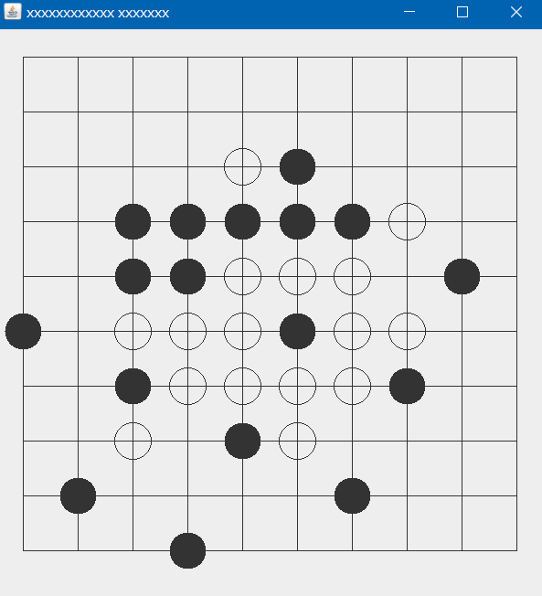

# Chess5_alpha
gobang五子棋人机对战实现

> ### 思路
因为五子棋的胜利条件为5连子，通过遍历整个棋盘，统计整个
棋盘五连子的位置并存储为一个数组当成一种赢法，然后调教参数让电脑，
例如：玩家在一种赢法上有2连子就加10分，3连子就50分，4连子就1000分（因为必赢）
电脑再下子时就判断在那里下会得到多分数，同时判断如何减少对方分数，从而达到人机对战的效果

> ### 最后
该版本为1.0，也是网上比较普遍的思想，该项目还有2.0版本是基于博弈树α-β剪枝搜索的五子棋

具体思路可参考

[基于博弈树α-β剪枝搜索的五子棋](https://github.com/colingogogo/gobang_AI)

到时有空再上传2.0版本
